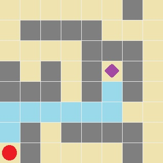

# Maze Shortest Path
This project intends to find the shortest path with artificial intelligence by walking step by step from start to destination point and representing every step to user in the map that occurs from 8*8 matrix and user can define start, destination and avaliable paths.

## Data Structure
A 64 elements list definition is made for the maze but node points will be defined by user. Distance and cost between nodes are calculated by aid of list. Stack, queue, linkedlist and list data structures are used for this.

## Visual interface
Shows user the shortest path (blue way) and tells how many step are taken and how far it is.

This is [the runnable jar file](Maze.jar) of the project.
